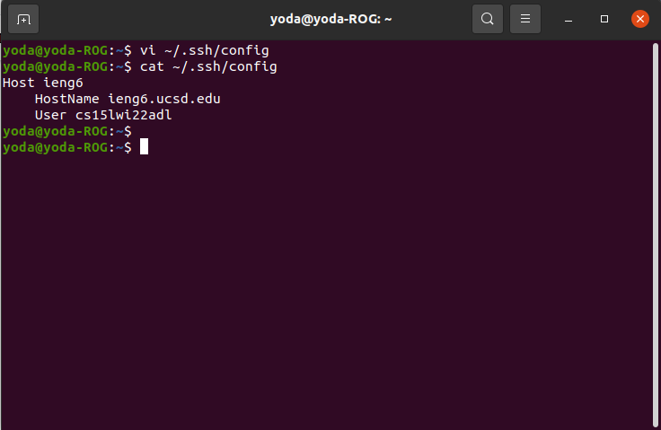
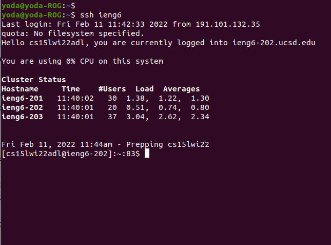

# Week 6 Lab Report
This is my lab report after Week 6 of CSE 15L. This report focuses on my implementation of ssh streamlining (option 1 from Week 5) so as to more easily access, copy, and run programs on the `ieng6` UCSD server provided to us for this course.

Return to smissula's index [here](index.md).

Over the course of this report, we will specifically be looking into:
+ Streamlining use of the `ssh` command by editing the ssh `config` file
+ Using the `ssh` login command with the new alias
+ Using the `scp` command (reiteratively) with the new alias

## Adding the `ssh` alias


Firstly, to create the alias, we need to edit the config file located at `~/.ssh/config`. In my case, I edited this file through the terminal-inbuilt `vim` editor (used with the `vi filename` command, as shown in the screenshot). The following text was added to the file:
```
Host ieng6
    HostName ieng6.ucsd.edu
    User cs15lwi22adl
```
This creates the `ssh` alias `ieng6` for my account on the UCSD server (ie. `cs15lwi22adl`). Note: I created and saved the file on the vim editor with the `vi ~/.ssh/config` command, so the results of that action are being shown with the `cat` command.

## Using the `ssh` alias
Now that the alias has been created, I can access my ieng6 server with just two short words:


Now that the `ieng6` alias has been assigned to my specific account, the command `ssh ieng6` has become a shorthand for the earlier, longer command `ssh cs15lwi22adl@ieng6.ucsd.edu`. Not only is this much shorter and faster to type, it is also much more convenient to remember.

## Using the `scp` command with the alias
Now all that's left to do is test if we can use in-line commands with the new, shortened `ssh` command, just as we could with the original `ssh` command (see [lab report 1](week2-lab-report.md#optimizing-server-commands) for more details).


In the commands above, we first entered the `markdown-parse` directory, where there are plenty of `.md` files waiting for us. We then use the optimized server command `ssh ieng6 ls` (instead of first entering the server, then using `ls`) to confirm that there are no markdown files in root directory of the server.

Then, we use the iterative secure copy command, `scp -r`. We specify to it to copy all the files with the `.md` ending (with `*.md`) to my ieng6 server. After doing this, another `ssh ieng6 ls` command shows how the root directory has changed, and now includes all of the `.md` files that are _also_ in the `markdown-parse` directory.

However, this new root directory seems a little messy, so we'll be doing a little more. By merging the commands to create a new directory in ieng6 called `tmp`, the command to move all markdown files into `tmp`, then a final `ls` to see if the effects have worked, we created the `tmp` folder and move all the markdown files in the root directory of ieng6 into it, all in one fell swoop, and with a fairly short command too, all compliments of the `ieng6` ssh alias.

A final command that lists directory for `tmp` instead of the root directory confirms that the mysteriously vanished markdown files have, in fact, shown up inside the `tmp` folder of the ieng6 server.

## Afternote
All things considered, I don't have much to say about this process. As useful as the `ssh` aliases are, they are also fundamentally easy to figure out and create. As such, they are likely an indispensable tool over the remainder of this course. I would highly recommend them, even to people who have opted for other options, if only because it will speed things up for you in future weeks.