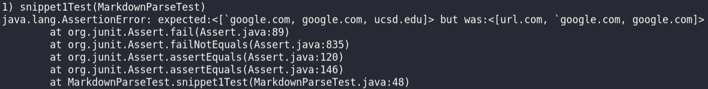
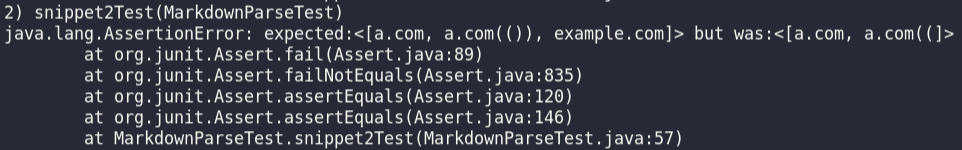
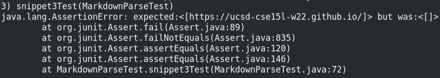
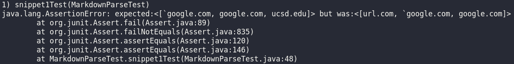
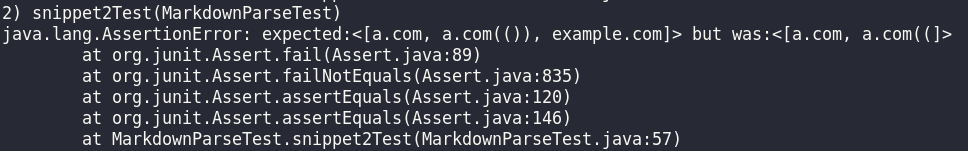
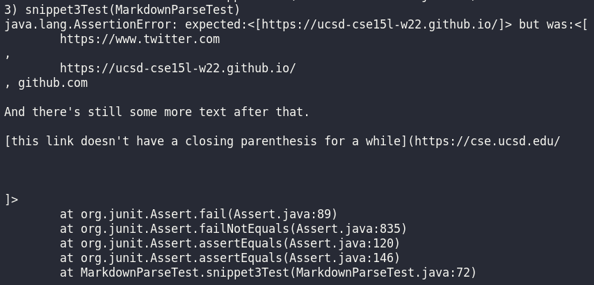

# Week 8 Lab Report
This is my lab report after week 8 of CSE 15L. As part of the week 7 lab, we had to review the MarkdownParse repository of the member of another group. As part of this lab report, we will be comparing [my repository](https://github.com/smissula/markdown-parse) to [their's](https://github.com/ajwboi/markdown-parse).

We will be comparing the performance of the `MarkdownParse.java` file on 3 provided snippets of markdown code. First, let us consider the expected output from each of them.

(PS. Return to the Github page for my repository [here](https://github.com/smissula/cse15l-lab-reports), and find the index page for this repo [here](https://smissula.github.io/cse15l-lab-reports/index.html).)

## Expected result from snippets
All of the following snippets have been provided by the CSE 15L Github page, and are going to be tested as is against the two markdown parsers specified above. Note that I have used the VSCode markdown preview to identify which links have been successfully rendered as hyperlinks on commonmark to determine what the expected output of each snippet should be.

Please note that I used VSCode preview _specifically_ to decide what should be produced. I did **not** use the [commonmark.js website](https://spec.commonmark.org/dingus/), which would have given a different result.


### Snippet #1
```
`[a link`](url.com)

[another link](`google.com)`

[`cod[e`](google.com)

[`code]`](ucsd.edu)
```

The expected output is: ``[`google.com, google.com, ucsd.edu]``.

### Snippet #2
```
[a [nested link](a.com)](b.com)

[a nested parenthesized url](a.com(()))

[some escaped \[ brackets \]](example.com)
```

The expected output is: `[a.com, a.com(()), example.com]`.

### Snippet #3
```
[this title text is really long and takes up more than 
one line

and has some line breaks](
    https://www.twitter.com
)

[this title text is really long and takes up more than 
one line](
    https://ucsd-cse15l-w22.github.io/
)


[this link doesn't have a closing parenthesis](github.com

And there's still some more text after that.

[this link doesn't have a closing parenthesis for a while](https://cse.ucsd.edu/


)

And then there's more text
```

The expected output is: `[https://ucsd-cse15l-w22.github.io/]`.

## Adding the snippet tests
For each of the snippets, a new JUnit test was added to `MarkdownParseTest.java`, both the one from my repository, and the other one that we had reviewed. Since there was no mention of using a seperate markdown file for the new tests, each of the snippets were converted to strings (as they would have been anyways, by `MarkdownParse`), and passed as arguments to the `getLinks` method.

The implementations of all three JUnit tests are shown below.

```
@Test
public void snippet1Test() throws IOException {
    String contents = "`[a link`](url.com)\n\n[another link](`google.com)`"
        + "\n\n[`cod[e`](google.com)\n\n[`code]`](ucsd.edu)";
    List<String> expect = List.of("`google.com", "google.com", "ucsd.edu");
    assertEquals(expect, MarkdownParse.getLinks(contents));
}
```

```
@Test
public void snippet2Test() throws IOException {
    String contents = "[a [nested link](a.com)](b.com)\n\n[a nested "
        + "parenthesized url](a.com(()))\n\n[some escaped \\[ brackets "
        + "\\]](example.com)";
    List<String> expect = List.of("a.com", "a.com(())", "example.com");
    assertEquals(expect, MarkdownParse.getLinks(contents));
}
```

```
@Test
public void snippet3Test() throws IOException {
    String contents = "[this title text is really long and takes up more "
        +"than\none line\n\nand has some line breaks](\n\thttps://www."
        +"twitter.com\n)\n\n[this title text is really long and takes up "
        +"more than\none line](\n\thttps://ucsd-cse15l-w22.github.io/\n)"
        +"\n\n\n[this link doesn't have a closing parenthesis](github.com"
        +"\n\nAnd there's still some more text after that.\n\n[this link "
        +"doesn't have a closing parenthesis for a while](https://cse.ucsd"
        +".edu/\n\n\n\n)\n\nAnd then there's more text";
    
    List<String> expect = List.of("https://ucsd-cse15l-w22.github.io/");
    assertEquals(expect, MarkdownParse.getLinks(contents));
}
```

## Results of the JUnit tests
The results of the JUnit tests are shown in the screenshots below. To phrase it simply, they all failed.

### My implementation






### Reviewed implementation






## Analysis of the outcome
Considering the... unfortunate nature of this outcome, we have to wonder if it would be possible to correct or improve the code so that these tests can be passed. We will only be considering if a minor change to `MarkdownParse.java` can be sufficient to help each individual test pass.

### Snippet 1
The test for snippet 1 failed because of the inline code, defined by the \` brackets. Personally, while I can find a possible solution for this, I don't think it would be considered a minor change. Although it could _possibly_ be implemented in 10~15 lines, it is still an upheaval of the existing code.

In order to get around this, a possible solution for my code would be to add a loop before the `while` loop, which finds all the "code" zones in the markdown file and skips them.

It would function as follows: the new loop would search for a \` symbol in the markdown. For every one it finds, it searches for another one _in the same line_. If it finds two \`s in the same line, it adds the index for each of them ((ie. an element of the form `[startIndex, endIndex]`)) to a 2D array, `codeZones`. If there is a starting \` without an ending \` within the same line of code, it is ignored.

After creating this array, in the regular `while` loop that is already present in `MarkdownParse`, if either of the brackets (`nextOpenBracket` or `nextCloseBracket`) in within the range of a code zone, then it should be ignored, and the next one should be found. For example, if `nextCloseBracket` is in a code zone, it should be recalculated to be the next closing bracket _after_ `endIndex`. After that, we check (with a while loop) to see if the new `nextCloseBracket` is in a code zone. This means any brackets within inline code will be ignored, and treated as part of the hyperlink text.

While I did consider that we could implement this more easily by simply checking if a \` bracket exists before and after each bracket, there are some issues with that approach. For example, for the markdown ``` `[a link`](url.com)```, the link would not be considered because the opening bracket `[` is inline code, and not part of a link. But something like ``` `some code`[a link`](url.com) ```, would not be considered a link, even though it should be.

The problem with simply checking for backticks before and after is that we don't know if the backticks are part of a completed pair. In the second example above, the backtick before ```[a link`]``` is part of a completed pair, so it won't interfere with the link's code. But without looping through the entire markdown file or the entire line beforehand, we don't know which pair each backtick is a part of, so we have no way of knowing whether a bracket is part of inline code, or between two inline code blocks.

This issue is why, although the minor change of checking for \` before and after each bracket would work for snippet 1, it would not be generalizable for all related cases of markdown with inline code.

### Snippet 2
The code already works for the nested link. To work for the nested parenthesis, a simple `while` loop would suffice. For every extra opening parenthesis found between `openParen` and `closeParen`, we update `closeParen` to be the next closing parenthesis after the current `closeParen`. This would take about 6 lines of code (at most).

For the escaped brackets, while either `nextOpenBracket` or `nextCloseBracket` are preceded by a backslash, we recalculate them to be the next possible bracket after the current one. This would take around 2 lines each for these loops.

In the end, we can make this change so that `MarkdownParse` works for snippet 2 (and related cases) just about barely in 10 lines, so this _could_ qualify as a minor change.

### Snippet 3
According to VSCode preview, a link with newlines only qualifies if there is a single newline before and/or after the link itself (within the parenthesis). For the portion within brackets, any number of newlines are allowed so long as there is some text between each newline.

Currently, my code skips any link that contains a newline between the opening bracket and closing parenthesis, so we would have to delete this `if` statement.

For the brackets case, we simply have to check if there are any double newlines (without nothing in between them) between the opening and closing brackets. If `\n\n` exists in the substring between `nextOpenBracket` and `nextCloseBracket`, then we skip the link, otherwise, we allow it. (This should take about three lines, since it's a single `if` statement.)

For the parenthesis case, right before the line where we add the substring to the `toReturn` ArrayList (line 120), we simply need to invoke the `trim` function on the substring between `openParen` and `closeParen`. Only if the trimmed substring doesn't contains a newline (`\n`), we add the trimmed substring to the final ArrayList, `toReturn`. (This should take about another three lines.)

And so, it is quite possible to implement this as a minor change, since it'll take well under 10 lines (although we will need to first **delete** three lines; it more or less evens out).

## Afterword
And that concludes my lab report for Week 8. Personally, I'm amazed by how much we've expanded on `MarkdownParse` since Week 3, I was sure we would have forgotten it by now.

I couldn't find what I would consider a "scalable" minor solution for passing snippet #1, so I'm afraid I'm going to have to relegate that to a larger implementation change, should we be asked to implement that change later on in this course. That said, I do believe I have the logic figured out, so it should be fun to do nonetheless. With that, I conclude this lab report.

Thanks for reading.\
Srivatsava Missula