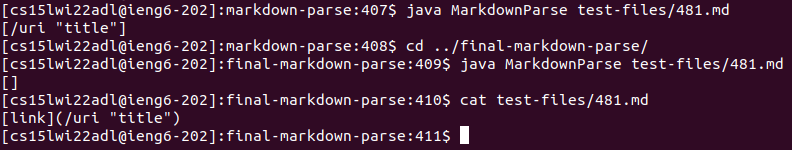
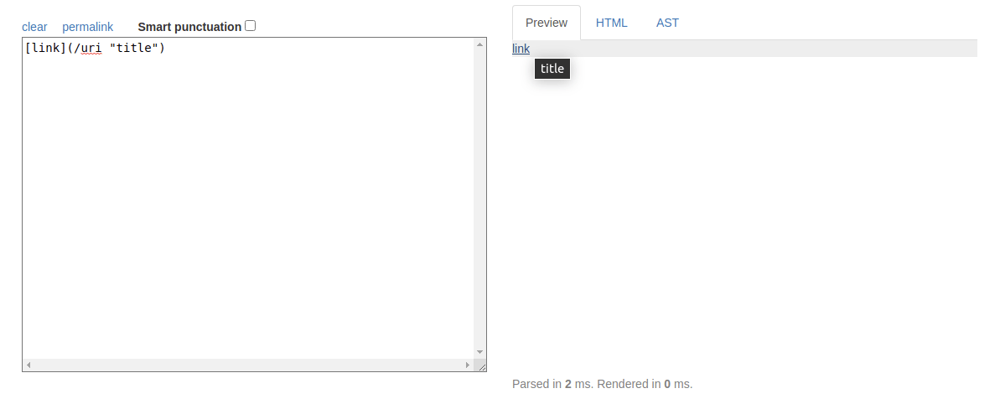
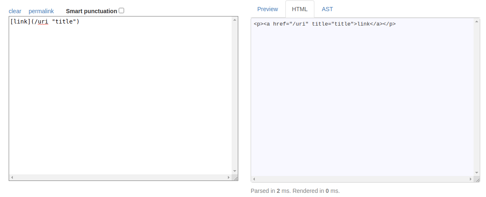
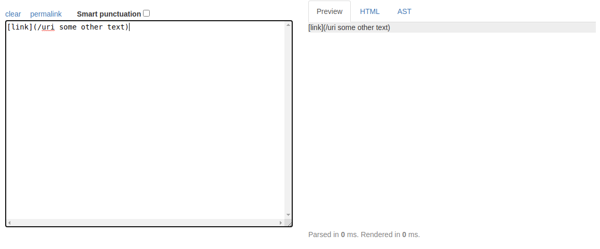

# Week 10 Lab Report

This is my lab report after week 10 in CSE 15L. As of week 9, we had been introduced to the idea of iterative, large scale testing, specifically with regards to our `MarkdownParse` implementation that we had been building on throughout the quarter.

My implementation can be found [here](https://github.com/smissula/markdown-parse). Similarly, you can return to [the Github page for this repository](https://github.com/smissula/cse15l-lab-reports), or access the [index page](https://smissula.github.io/cse15l-lab-reports/index.html) for its Pages.

By taking some of the several thousand tests used by the `commonmark` library, we set out to test our `MarkdownParse` implementations. Similarly, we also used these tests against a different, independent implementation of `MarkdownParse` that had been provided to us by Professor Politz. Other than some obvious programmatic differences that we addressed (some of which we even tried to eliminate) in week 9, this lab report will address how the two implementations are at times different, and how we can identify, diagnose, and potentially fix these differences.

## Identifying the differences
Firstly, we set out to try and find out the ways in which these two programs are different. While it would be possible to go through the code manually to note differences in logic, this would be wildly inefficient if there were thousands of lines of code in each `MarkdownParse`. While this fortunately isn't the case, it would still be a poor idea. Instead, we will just be comparing the output of the test cases directly.

In order to do this, we will be using the following script, known as `script.sh`. The code is as follows. The purpose of this bash script is to compile the `MarkdownParse` in either repository and run all of the test markdown files in `test-files/`. Note that `test-files/` has been replicated into both repositories.
```
javac -cp ".:lib/*" MarkdownParse.java
for file in test-files/*.md;
do
  echo $file
  java MarkdownParse $file
done
```

By using **output redirection**, we can store the results of all of these `echo` and print statements (the print statements executing in `MarkdownParse`, that is) to a single text file each. For example, running `bash script.sh > text.txt` will store all of the output in a text file called `text.txt`. For this lab report, we have stored the results of _my_ implementation in `output.txt`, and stored the results of the provided implementation in `output_final.txt`.

It should be noted beforehand that it is imperative for later steps that the format of output of both files is the same. In order to achieve this, some small changes had to be made to the `MarkdownParse` files. In the case of the provided implementation, for example, I made sure that the input arguments would be treated as separate test files instead of a single directory. Further, I made sure that the output in both files would strictly be an `ArrayList`, since these are easier to compare visually than a `Map`.

Having done this, we can rest assured that executing `bash script.sh > output.txt` in my directory and `bash script.sh > output_final.txt` in the provided directory would both generate test files that look roughly like this:
```
test-files/1.md
[]
test-files/10.md
[something]
test-files/100.md
[]
test-files/101.md
[this_isn't_the_actual_output]
test-files/102.md
[just_something_i_made_up]
```

Now that we have two _very_ similar looking text files, we can compare them using the `diff` command in the terminal. (Note that I first moved `output_final.txt` to my implementation's folder, so they would be in the same directory.) By running `diff output.txt output_final.txt`, we can get a side-by-side comparison of every line that is different in both files. This is extremely useful, since it means we don't have to manually compare hundreds of lines of code; only the different lines will even show up when using the `diff` command.

The output of me using the `diff output.txt output_final.txt` command was this:
```
212c212
< []
---
> [url]
230c230
< []
---
> [baz]
270c270
< [/bar\* "ti\*tle"]
---
> []
492c492
< [/f&ouml;&ouml; "f&ouml;&ouml;"]
---
> []
692c692
< [url &quot;tit&quot;]
---
> []
850c850
< [/uri "title"]
---
> []
862c862
< [/my uri]
---
> []
864c864
< [</my uri>]
---
> []
878c878
< [\(foo\]
---
> [\(foo\)]
880c880
< [foo(and(bar]
---
> [foo(and(bar))]
882c882
< [foo(and(bar]
---
> []
884c884
< [foo\(and\(bar\]
---
> []
886c886
< [<foo(and(bar]
---
> []
902c902
< [/url "title", /url 'title', /url (title]
---
> []
904c904
< [/url "title \"&quot;"]
---
> []
908c908
< [/url "title "and" title"]
---
> []
910c910
< [/url 'title "and" title']
---
> []
916c916
< []
---
> [/uri]
918c918
< []
---
> [/uri]
920c920
< []
---
> [/uri]
934c934
< []
---
> [uri1]
1040c1040
< [not a link]
---
> []
1054c1054
< []
---
> [/url]
1056c1056
< []
---
> [/url]
1062c1062
< []
---
> [train.jpg]
1066c1066
< []
---
> [<url>]
1070c1070
< []
---
> [/url]
```

While certainly a lot to read through (not that I expect you to read the whole thing), it's much, _much_ better than having to read *everything* in both files. For the purposes of this lab, we will be focusing on only two of these differences.

+ In line 850 of both output files, `test-files/481.md` is tested.\
My implementation identifies a link, containing `/uri "title"`, whereas the provided implementation states that no link exists.
+ In line 1062 of both output files, `test-files/577.md` is tested.\
My implementation doesn't identify any link, but the provided implementation identifies `train.jpg` as one.

We will be looking into both of these differences in depth before making a final judgment on which one (if either) is correct, and what we can do to fix the incorrect one(s).

## Difference 1: `481.md`
Just to revise, the `diff` operation above, stated the following:
```
850c850
< [/uri "title"]
---
> []
```

This means that on line 850 of both output files, there is a difference. Looking at line 850 shows that it contains the output of testing `MarkdownParse` on the test file `481.md`. Below, I run the `MarkdownParse` manually on this file again to see what the different results are. (I also printed out the contents of `481.md` so we can be clear on it.)



For the markdown `[link](/uri "title")`, my implementation identifies `/uri "title"` as a link, whereas the provided implementation states it isn't a link at all. Let us see what commonmark (which we will assume to be the correct implementation) has to say:


The preview shows clearly that this markdown _should_ render a link, but looking at the HTML tells a more interesting story:


While the provided markdown does create a link, the url of the link should be just `/uri`, and not `/uri "title"`, since `title` is not part of the link, but the hover text we should get when putting our cursor over the hyperlink. In other words, both implementations are kind of wrong.

For the sake of this lab report, we only need to discuss one of the implementations when both are wrong, so let's focus on the provided implementation by Professor Politz, since it fails to recognize there is a link, period (compare that to identifying the link slightly incorrectly, and you see this is a bigger issue).

The problem lies in this component of the `getLinks(String markdown)` method of the provided implementation:
```
if(potentialLink.indexOf(" ") == -1 && potentialLink.indexOf("\n") == -1) {
    toReturn.add(potentialLink);
    currentIndex = closeParen + 1;
}
else {
    currentIndex = currentIndex + 1;
}
```

Effectively, this `if-else` around the end of the `while` loop means that if there is a single space in a potential link, it will be considered invalid and discarded. Only a link without any spaces in it is considered a valid link. Since my implementation has no such check, it's easy to see why this link was rendered there but not here.

Strictly speaking though, the provided implementation isn't completely wrong either. Even commonmark agrees that normally, a link with a space in it doesn't qualify as a link. The only exception is if there is a space between the hyperlink itself and the hover text, which is surrounded by double or single quotes.

One correction that can be made to the provided implementation is to just check if there is hover text when there is a space in the link. If there is a single or double quote in the index right after the space, as well as the same character in the index exactly before the close paren, then the link should pass, although only the contents before the space are the hyperlink, and the hover text between the quotes should be processed separately.

This check should also make sure that the second quote character doesn't show up anywhere else in between the space and the closing parenthesis. For example, `[](hyperlink.html "Some hover's text")` is valid, but `[](hyperlink.html "Some hover"s text")` is invalid, because the second `"` appears before the end of the link, ending the hover text indicator prematurely.

To sum it up, there should be an additional `if` statement inside of the first one (which identifies that there is a whitespace). It should check that the first character after the whitespace is either `'` or `"`. If it is, then the next instance of `'` or `"` after that should be `closeParen-1`. Otherwise, the link should be considered invalid, and shouldn't be added to the `Arraylist`. (If it is being added, perhaps only the substring before the whitespace should be added to the hyperlink `Arraylist`).

I can't help but feel a similar change should be made to my implementation too, since links with spaces that do not have hover text are not rendered as links in Markdown (see below). In that regard, the same modified `if-else` statement that I proposed for the provided implementation should go in my implementation as well.


## Difference 2: `577.md`
The second difference we will be addressing has to do with the following result from `diff`:
```
1062c1062
< []
---
> [train.jpg]
```

This line tests `test-files/577.md`, which has the following contents:
```

```

From this output, it is plain to see that the file contains a single line, which is supposed to render the image `train.jpg`. _This is not a link_, just an image, so the provided implementation is wrong for giving `[train.jpg]` as the output. Since there is nothing but this one line in the test file, the expected output is simply `[]`, which is what my implementation provides.

The fix to this is simple, and has in fact been discussed during one of the labs of this course. When identifying a potential link, we simply have to check if there is an exclamation mark (`!`) exactly one index before the opening bracket of a link. If there is, the current potential link should be discarded (we can set `currentIndex` to `nextOpenBracket+1`).

This has already been implemented in my `MarkdownParse`, so it might just be easier to show that:
```
if (nextOpenBracket != 0 && markdown.substring(
            nextOpenBracket-1, nextOpenBracket).equals("!")) {
    currentIndex = closeParen + 1;
    continue;
}
```
By including this `if` statement before the final check that adds the link to the `Arraylist`, the problem is easily fixed.

## Afterword
And that concludes my last lab report for CSE 15L. Hopefully, there haven't been any issues so far, and there won't be any more in the near future. I can honestly say that this was a fairly interesting and practically useful lab course, and I'm sure there will be numerous applications for what I've learnt to do here over the last quarter. For that, I extend my gratitude to the staff and faculty of this course.

Thank you and regards,\
Srivatsava Missula