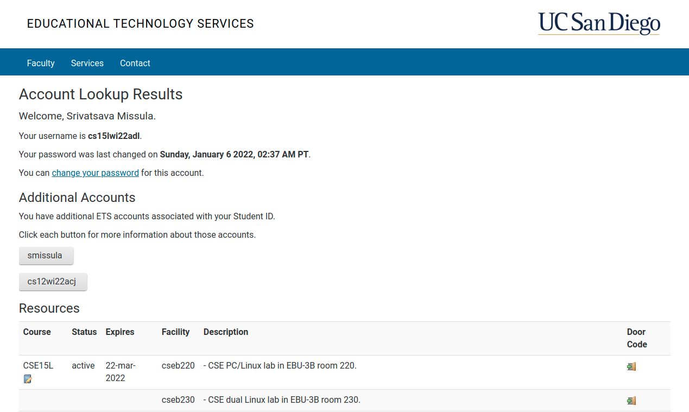
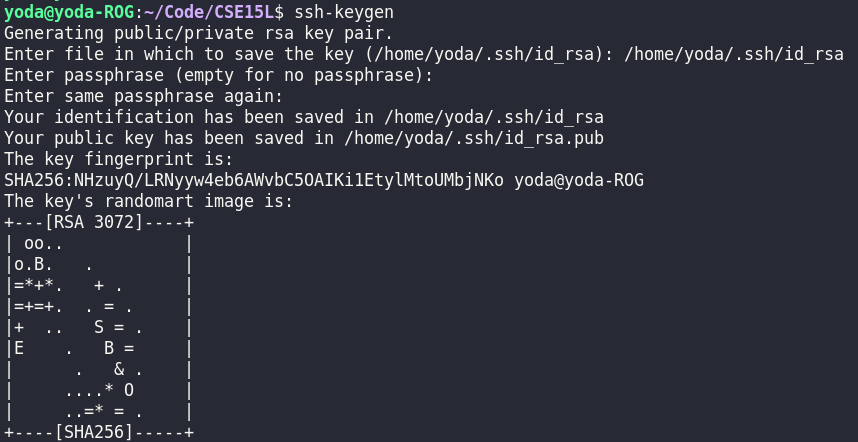

# Week 2 Lab Report
If you're seeing this because you've enrolled in UCSD's CSE15L course, congratulations! Not only did you make it into one of the most competitive courses in the UCSD Computer Science department, but the fact you're reading this implies either a staunch drive to get ahead with the material, or the commitment to clarify doubts and ensure your basic setup for the rest of the quarter is comprehensive.

God forbid you're on this blog for any other reason.

That said, the initial installations _are_ important. They will form the basis of the rest of the course, and a large portion of your assignments and workload may in fact be contingent on you getting this right, so let's dig into it. We'll be covering:
- How to install and setup Visual Studio Code
- Setting up your CSE15L SSH to connect to
- Connecting to your UCSD SSH account through VSCode
- Using basic commands on your UCSD server
- Moving files to the server from your computer
- Optimizing your server usage (with SSH keys and more)

## Installing Visual Studio Code
First off, VSCode is a code editing software, one of the best out there for creating, testing, and running code. As such, it is expected that you use it as well for this course. Fortunately, installing it is a real cinch on Ubuntu, and quite possibly the easiest step in this guide.

Start off at the [VSCode website](https://code.visualstudio.com/). You should see the download option right there, smack in the middle of the website you just opened. You need but to click it to begin the process.


Once again, I'm an Ubuntu user, and proud of it. In my case, all I had to do was press the installed file when it showed up in the Downloads bar in the bottom of my web browser (see the image below). After that, the installation mostly finished itself (I only had to press some green buttons, and agree to some terms along the way). I'm told the process is almost identical on inferior systems (Windows and Mac), so there shouldn't be any problems with that.


## Setting up your UCSD SSH
An important preliminary step before connecting to the SSH itself, you'll need to go to the [UCSD Account Lookup](https://sdacs.ucsd.edu/~icc/index.php) page. There, enter your username and student ID (PID), to access your UCSD online accounts.


One of these accounts will be of the form `cs15lwi22***`. Click it, and it should show you something like this:



If this is your first time on the site, it might prompt you to change your password first, in which case you'll need to before being able to access your SSH. Even if it doesn't prompt you to, I would recommend pressing the "change your password for this account" option, as it'll let you set a unique password for your SSH account. If you don't, your password will be the same as your student login/email, which might be unsafe (although it's your prerogative; I changed it because my student password is _way_ too long).

## Remotely connecting to SSH
Again, I can't speak for Windows users, but I'm told they'll need to install the [OpenSSH program](https://docs.microsoft.com/en-us/windows-server/administration/openssh/openssh_install_firstuse) to proceed with this step. But if you're in Linux (and Mac, I guess), this comes pre-installed. Just in case you need further motivation to swap over to the **objectively superior** operating system (I swear this is the last time I'll dunk on Windows).


Once ready, open up your shiny new VSCode app. Once past the initial terms, conditions, and other stuff, you should be able to open the "Terminal" section of the menu bar. From there, select "New Terminal". (Alternatively, you can just press Ctrl+Alt+` to get there immediately.) You should find that the bottom portion of VSCode is now overlayed, now showing a terminal monitor.


After finding out your exact account ID (of the form `cse15lwi22***`) from the [Account Lookup tool](https://sdacs.ucsd.edu/~icc/index.php), enter the following command into your VSCode terminal to access it: `ssh cse15lwi22***@ieng6.ucsd.edu`.


After entering the command above, you'll be prompted to enter your password (either your student password, or the unique one you set up in the last step). After doing so, you'll get a long list of outputs as shown above. At the end of it though, your terminal prompt will look something like this:

```
Hello cs15lwi22adl, you are currently logged into ieng6-202.ucsd.edu

You are using 0% CPU on this system

Cluster Status 
Hostname     Time    #Users  Load  Averages  
ieng6-201   20:35:01   23  2.45,  2.44,  2.55
ieng6-202   20:35:01   18  2.11,  2.18,  2.21
ieng6-203   20:35:01   18  2.19,  2.26,  2.24

 
Thu Jan 13, 2022  8:35pm - Prepping cs15lwi22
[cs15lwi22adl@ieng6-202]:~:6$
```

A prompt looking something like `[cs15lwi22***@ieng6-202]:~:6$` will indicate you've successfully logged into your SSH.

### Bonus tip for Ubuntu users
If you're familiar at all with a Linux terminal, you might know the concept of an alias. It mgith get cumbersome to type every single time you want to log in, so I would recommend [setting up an alias](https://www.cyberciti.biz/faq/create-permanent-bash-alias-linux-unix/) that does it for you. In my case, I set `alias cse15l-ssh="cse15lwi22***@ieng6.ucsd.edu`. This way, I log into my SSH by simply typing `ssh cse15l-ssh` instead of the longer expression.

Since your VSCode terminal is literally just a localization of the Linux terminal itself, all aliases and customizations you make to your terminal are applicable to the VSCode terminal as well. _I can't say for certain if this option is available for Ubuntu or Mac users._ That said, you can search it up if you're interested.

## Using basic commands
Once you've successfully made it into the server through SSH, there are some basic commands you might want to familiarize yourself with. First among these are `ls` and `cd`.

Typing `ls` lists all the folders and files present in your current directory. In my case, it went like this:
```
[cs15lwi22adl@ieng6-202]:~:6$ ls
perl5
[cs15lwi22adl@ieng6-202]:~:6$
```

If you enter `ls -a` instead, it will provide a more detailed catalogue, specifically including a bunch of hidden files that you wouldn't be able to see normally:


Entering `ls -lat` shows hidden files too, but it also provides _a lot more_ detail on all of the files. Output looked like something like this for me (I removed some of the lines out of concern for brevity; you should get the idea nonetheless):
```
[cs15lwi22adl@ieng6-202]:~:7$ ls -lat
total 120
-rw-r--r--   1 cs15lwi22adl ieng6_cs15lwi22  1346 Jan 13 20:35 .modulesbegenv
-rw-r-----   1 cs15lwi22adl ieng6_cs15lwi22     0 Jan 13 20:35 .motd
drwxr-sr-x 634 cs15lwi22    ieng6_cs15lwi22 49152 Jan 12 08:05 ..
-rw-------   1 cs15lwi22adl ieng6_cs15lwi22    21 Jan 11 03:04 .bash_history
drwxr-s---   6 cs15lwi22adl ieng6_cs15lwi22  4096 Jan 11 03:04 .
drwxr-sr-x   3 cs15lwi22adl ieng6_cs15lwi22  4096 Jan  6 03:01 .cache
drwxr-sr-x   2 cs15lwi22adl ieng6_cs15lwi22  4096 Jan  6 03:01 perl5
drwxr-sr-x   3 cs15lwi22adl ieng6_cs15lwi22  4096 Jan  6 03:01 .local
[cs15lwi22adl@ieng6-202]:~:8$ 
```

Well, our initial bout with `ls` revealed to us that the default, base directory had only one non-hidden file: a folder called "perl5". We can also use `ls` to look inside known directories, such as through `ls perl5/` (you don't need to type the entirety of "perl5/", you can use tab-autocomplete). In my case (and possible yours as well), this folder was empty, so there was no output from the command.

Another really important command is `cd`, which stands for "**c**hange **d**irectory". Typing `cd dir` will move you from your current directory position to inside `dir`, assuming `dir` exists in your current directory. A more realistic example would be `cd perl5/`, which will move the VSCode terminal from the root position of the SSH to inside `perl5`. Typing just `cd`, without any directory after it, will just return you to the root position, while `cd ..` will move you back _exactly one folder_. Not all the way to the root, just one directory backward from your present one.

Another interesting command is `mkdir`, which allows you to create a folder. In the code below, we're going to use a combination of aforementioned commands. First, we create a new folder called `tmp` with the `mkdir` command. Then, we enter it through `cd tmp/`, and check its contents with `ls`. Unsurprisingly, this new directory is empty. After seeing that, we return to the root directory with `cd`.


In the image above, we can easily tell which directory we're in through the terminal prompt. `[cs15lwi22adl@ieng6-202]:~:` becomes `[cs15lwi22adl@ieng6-202]:tmp:` when we move from the root directory to the `tmp` directory. The converse holds as well, since the `tmp` portion is replaced by `~` when we move back to the root directory with `cd`.

If that is insufficient, you can always check your present directory with the `pwd` command. Inside the root directory, it looks like:
```
[cs15lwi22adl@ieng6-202]:~:16$ pwd
/home/linux/ieng6/cs15lwi22/cs15lwi22adl
```

Whereas inside the `tmp` directory, it yields:
```
[cs15lwi22adl@ieng6-202]:~:17$ cd tmp/
[cs15lwi22adl@ieng6-202]:tmp:18$ pwd
/home/linux/ieng6/cs15lwi22/cs15lwi22adl/tmp
```

Finally, there's `cp`, the **copy** command. It's used by specifying the object to copy, and the object location to copy it into. First, let's have a text file called `eg.txt` in the root directory, which contains just the text `Hello, world!`. We can check this through the `cat` (concatenate) method as shown below. We can copy `eg.txt` into the `tmp` directory through the command `cp eg.txt tmp/eg2.txt`. This creates a copy of `eg.txt` called `eg2.txt` _inside_ the tmp folder. This is verified with `ls` and `cat`.


You can exit the server by either pressing Ctrl+D, or typing the `exit` command. The result will look something like below, after which your terminal goes back to its default prompt and directory (inside your computer):
```
[cs15lwi22adl@ieng6-202]:~:27$ exit
logout
Connection to ieng6.ucsd.edu closed.
```

## Moving files to the server
To upload files from your computer's local drive to your SSH server, we use the `scp` command. You simply enter `scp`, followed by the file's name, then your CSE15L server account name. In the following example, I entered `Code/CSE15L` through my VSCode terminal before uploading a file I had there called `example.java` to my UCSD server:


Later, logging into my server and checking with `ls` reveals that the upload was, in fact, successful.
```
Hello cs15lwi22adl, you are currently logged into ieng6-202.ucsd.edu

You are using 0% CPU on this system

Cluster Status 
Hostname     Time    #Users  Load  Averages  
ieng6-201   21:30:01   24  2.06,  2.22,  2.32
ieng6-202   21:30:01   16  2.08,  2.26,  2.37
ieng6-203   21:30:01   16  2.06,  2.18,  2.25

 
Thu Jan 13, 2022  9:31pm - Prepping cs15lwi22
[cs15lwi22adl@ieng6-202]:~:28$ ls
eg.txt  example.java  perl5  tmp
```

## Creating an SSH key
You know what's inconvenient? Passwords.

Seriously though, as important as they are for security, having to type it _every single time_ I'm accessing or uploading a file to the SSH can get old really quickly. For that, we create an **SSH key**, which pre-establishes a key between your computer and your SSH to simplify the process henceforth. For that, first use the `ssh-keygen` command on your terminal (in your local drive, not the server), to create public and private key files:


After this, you'll want to create a `.ssh` folder in your SSH to put the public key in. Log in, and enter the commands below. (Remember `mkdir`? Comes in handy, doesn't it?)
```
[cs15lwi22adl@ieng6-202]:~:29$ mkdir .ssh
[cs15lwi22adl@ieng6-202]:~:30$ exit
```

Then, back on your local drive, copy the public key you just created into the `.ssh` directory (which you also just created) with the `scp` command as follows:


And that's it! You can now `ssh` and `scp` into your CSE15L server account whenever you want without having to type your server/student password (unless you created a password for your `keygen` key like I did, in which case you'll have to type that password just once).

## Optimizing server commands
As it turns out though, you don't _always_ need to log in to the server to run commands in it. For example, back in the `scp` example above, where we copied `example.java` into the root directory, we didn't have to log in to check if it made it there. Simply typing `ssh cs15lwi22***@ieng6.ucsd.edu "ls"` would have done the trick in one line (it also wouldn't have logged us in, so we wouldn't need to log out).


It's also possibly to do this with multiple commands at once, as we see in the image above. By typing multiple commands (separated by semi-colons) inside the double quotes it becomes possible to, say, copy `example.java` into the `tmp` directory, access the `tmp` directory, and concatenate the `example.java` inside of it. All this in the span of a single line.

Handy, ain't it?

### Keystroke optimized
In order to quantify the improvement of these optimized commands. After creating the new file `WhereAmI.java`, this is by far the fastest method by which I could `scp`, then run this new file on the server:
```
yoda@yoda-ROG:~/Code/CSE15L$ scp WhereAmI.java cse15l-ssh
yoda@yoda-ROG:~/Code/CSE15L$ ssh cse15l-ssh "javac WhereAmI.java; java WhereAmI"
```

Unfortunately, this whole process, shown in the two lines above, took a total of **52** keystrokes, mostly because tab-autofill didn't function for the code inside the quotes. I was able to greatly reduce the keystrokes required for the `ssh` and `scp`, however, by using Terminal aliases.

As for the process of just running a file after editing it, however...
```
[cs15lwi22adl@ieng6-202]:~:29$ javac WhereAmI.java ;java WhereAmI
```
On top of using tab-autofill, the process above of compiling and running a file came out to exactly **12** keystrokes. While I couldn't come up with any ideas for speeding this up any further, 12 (as opposed to 52) doesn't pose much of an issue, considering many coders (including myself) easily hit 80 wpm on standardised typing tests. What about you?

## Afterword
Do note that everywhere in this post where I used `cs15lwi22***`, the triple asterisks were a stand-in for your unique account characters. You can find them on the [Account Lookup tool](https://sdacs.ucsd.edu/~icc/index.php), as we discussed in the earlier steps. You may notice in some screenshots that the `***` were replaced by `adl`, which are my unique characters. Use your own account name/characters, don't copy mine, you don't have my password (at least I hope you don't).

If you've stuck around for this long, and are able to more or less replicate all the examples and commands I've used so far, congratulations! You've successfully completed your initial setup, and are good to go for this course!

Well, the first week, anyways.

Wishing you well for the battles to come, \
Srivatsava Missula