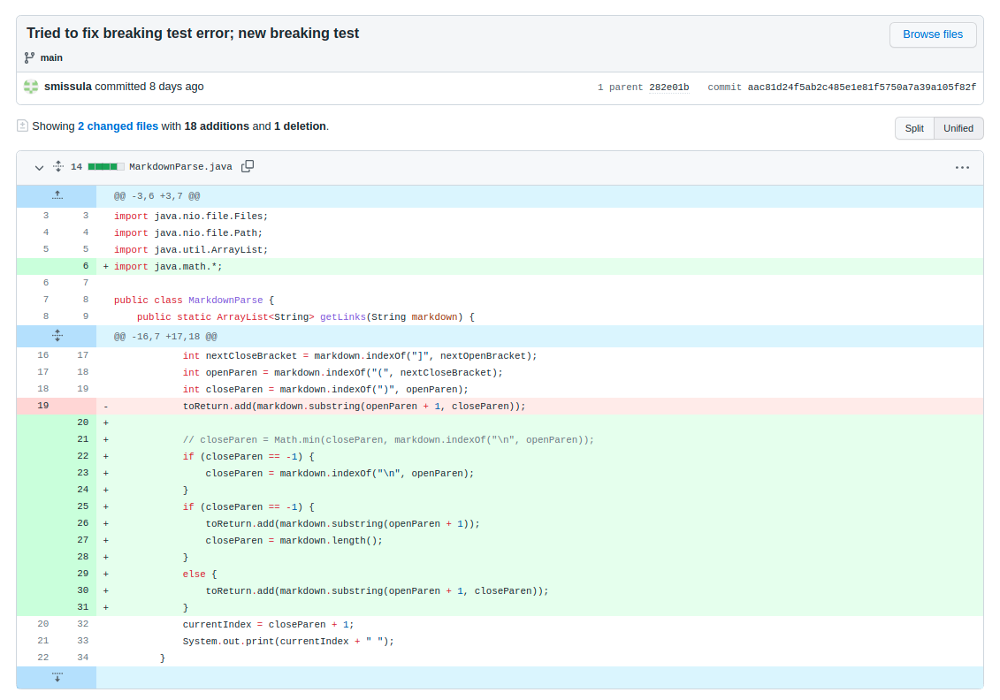
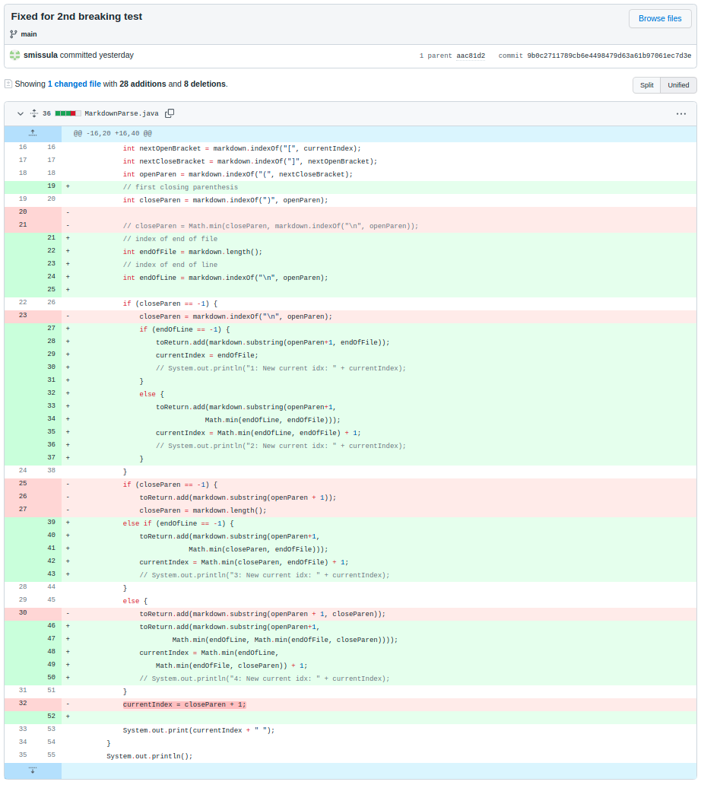
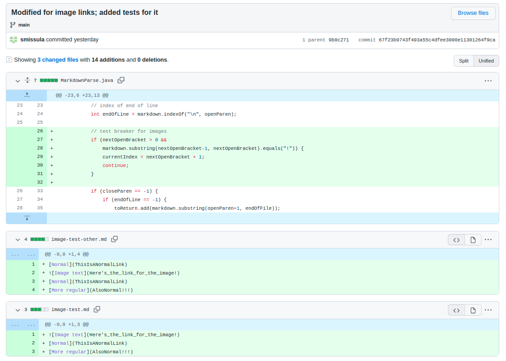

# Week 4 Lab Report
This is my lab report after Week 4 of CSE 15L. This report focuses on debugging, and the nature of breaking tests, all based on the "MarkdownParse" program provided to us by Professor Joe Politz.

Firstly, we should get some basic definitions straight:
+ A **bug** is a flaw in a computer program that causes it to produce incorrect (unexpected) results, thus rendering it an imperfect implementation
+ A **symptom** is the observable result of a bug; the manifestation of the erroneous behavior caused by a bug
+ A **failure-inducing input** is an input provided to a program that prompts an error or failure instead of running as intended. Since _correctness_ in a program is defined as getting appropriate outputs for _every_ intended input, a failure-inducing input implies the program itself in incorrect.

We will now be exploring three code changes in "MarkdownParse" in response to different bugs, chronicling the bug, failure-inducing input, and symptom of that input, as well as the measures taken to correct this error. You can find and access the full history of this version of `markdown-parse` in [my Github repository](https://github.com/smissula/markdown-parse).

## Code change #1: Incomplete link
The first bug we encountered was when we tried to run [`breaking-test.md`](https://github.com/smissula/markdown-parse/blob/main/breaking-test.md), which had the contents below:
```
This is a new test: we're testing syntax errors now!

[False link](https://www.github.com/
```

Because of the open link in the markdown (no closing parenthesis to signal the end of the link), following error was encountered while running the program on `breaking-test.md`:

```
yoda@yoda-ROG:~/Code/CSE 15L/markdown-parse$ java MarkdownParse breaking-test.md 
0 Exception in thread "main" java.lang.StringIndexOutOfBoundsException: begin 67, end -1, length 90
        at java.base/java.lang.String.checkBoundsBeginEnd(String.java:3319)
        at java.base/java.lang.String.substring(String.java:1874)
        at MarkdownParse.getLinks(MarkdownParse.java:18)
        at MarkdownParse.main(MarkdownParse.java:28)
```

This is because the `indexOf` function looking for the closing parenthesis doesn't find one, and so stores `-1` to the variable `closeParen`. Later lines try and pass this `closeParen` variable to the substring function, which is what caused the error above.

In order to correct this, the following code change was implemented:



In the code change above, if the `closeParen` variable is found to be `-1` (ie. there are no closing parenthesis in the test file), it is set to the next new line instead. If this is also `-1` (which means the link is on the last line of the file), the program considers the end of the file to be the end of the link.

## Code change #2: Multi-line link
<!-- ### Code change


### Failure-inducing symptom
breaking-test-other.md

### Symptom
```
yoda@yoda-ROG:~/Code/CSE 15L/markdown-parse$ java MarkdownParse breaking-test-other.md 
0 171 
[https://www.github.com/
[False link](https://something.github.com/
[False link](https://www.github.com/]
``` -->

The second bug is slightly related to the first. To further test and ensure the code change above was effective. It was created in response to the improper output the program produced in response to [`breaking-test-other.md`](https://github.com/smissula/markdown-parse/blob/main/breaking-test-other.md), which had the following contents:
```
This is a new test: we're testing syntax errors now!

[False link](https://www.github.com/
[False link](https://something.github.com/
[False link](https://www.github.com/)
```

While there are two incomplete links in this file, it ran properly with `MarkdownParse.java`, although the output wasn't quite what we expected.
```
yoda@yoda-ROG:~/Code/CSE 15L/markdown-parse$ java MarkdownParse breaking-test-other.md 
[https://www.github.com/
[False link](https://something.github.com/
[False link](https://www.github.com/]
```

Although no errors or exceptions were thrown, this revealed another vulnerability the program: it considered most of the file—from the beginning of the first link to the closing bracket at the end of the file—to be a single link.

This is because the program looks for a closing bracket after the opening one, and so long as it finds one, it uses it, irrespective of whether it comes before or after a newline (`\n`). While this is necessarily defective behavior, it isn't ideal, either. As normal markdown doesn't consider multi-line links. Also, as per our team's consensus, we had intended for the previous code change to automatically set the end of the line to be the end of a link (if necessary), which wasn't happening here.

The following code change was enacted to fix this:


This code change takes the index of the next closing paranthesis, the next newline character, and the end of file. It excludes any of these values if they are `-1`, and then identifies the smallest one to use as the end of the link. After modifying it as such, the output from processing `breaking-test-other.md` became:
```
[https://www.github.com/, https://something.github.com/, https://www.github.com/]
```

...Just as we intended.

## Code change #3: Ignore images
<!-- ### Code change


### Failure-inducing symptom
image-test.md

### Symptom
```
yoda@yoda-ROG:~/Code/CSE 15L/markdown-parse$ java MarkdownParse image-test.md 
0 45 73 103 
[Here's_the_link_for_the_image!, ThisIsANormalLink, AlsoNormal!!!]
``` -->

The final bug was of a different nature. The current `MarkdownParse.java` logic meant that the link given for an image insertion in the markdown will show up in the output too, even though it's an image directory, not a hyperlink.

This was observed on the test file [`image-test.md`](https://github.com/smissula/markdown-parse/blob/main/image-test.md), which had the following markdown:
```

[Normal](ThisIsANormalLink)
[More regular](AlsoNormal!!!)
```

Ideally, only the second two links (`ThisIsANormalLink` and `AlsoNormal!!!`) should have shown up in the output array, but because of the aforementioned logic, the following erroneous output was produced instead:
```
yoda@yoda-ROG:~/Code/CSE 15L/markdown-parse$ java MarkdownParse image-test.md 
[Here's_the_link_for_the_image!, ThisIsANormalLink, AlsoNormal!!!]
```

In order to correct this, we coded in a special case for image links in the markdown. If a link's opening bracket (`[`) was preceded by an exclamation mark (`!`), it would be identified as an image, and the "link" would be discarded and ignored. It was implemented as follows:


After this change in implementation, the output from running `image-test.md` was finally correct:
```
yoda@yoda-ROG:~/Code/CSE 15L/markdown-parse$ java MarkdownParse image-test.md 
[ThisIsANormalLink, AlsoNormal!!!]
```

This change was tested with some additional test files geared towards images. Fortunately, this code change meant that the new `MarkdownParse.java` passed all of these with flying colors.

## Afterword
And that's the end of this lab report. Although some aspects of finding and removing bugs were certainly irritating, the experience as a whole was enlightening, particularly towards the effort it takes to produce large-scale, fulling working systems, as well as the utility of even (technically) incorrect systems.

Thanks for reading,\
Srivatsava Missula